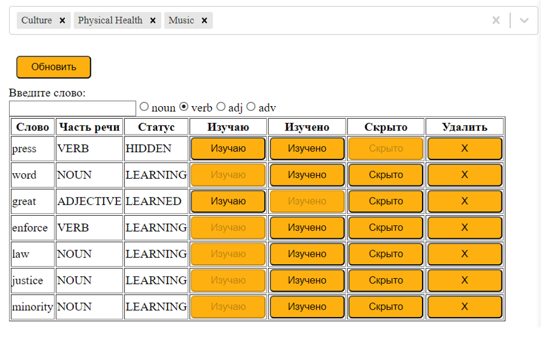

# WhereTheWords App

### Описание

WhereTheWords - это веб-приложение для индивидуального подбора текстов при изучении иностранного языка.  
Пользователь ведет список слов, которые он в данный момент изучает, а также список интересных ему тематик слов, а приложение выбирает из базы данных тексты, максимально подходящие под запросы пользователя.

### Инструменты разработки

Серверная часть - Spring Framework  
СУБД - PostgreSQL  
Обработка естественного языка - Stanford CoreNLP  
Классификация текстов - LingPipe

Клиентская часть - ReactJS, MobX

### База данных приложения

### Датасет

Для обучения классификатора и наполнения базы использовался датасет [20 Newsgroups](http://qwone.com/~jason/20Newsgroups/)

### Ведение списка слов и тематик

### Добавление текстов

#### Ввод текста пользователем

Пользователь вводит новый текст  

#### Обработка текстов

При добавлении пользователем текста для всех слов, не являющихся стоп-словами, определяется его лемма, часть речи и уровень языка, на котором это слово нужно знать. Эта информация попадает в БД. 

Уровень языка слова определяется по спискам Oxford 3000 и Oxford 5000

Уровень языка текста определяется как минимальный уровень, где слова этого уровня и ниже составляют не менее 95% от всех слов текста

#### Подтверждение добавления

Пользователь с ролью администратора видит тексты, которые предлагаются к добавлению, а также определенные классификатором тематики текста. Он может отредактировать текст и тематики, принять или отклонить текст.  

### Предложение текстов

#### Запрос текстов

Пользователь выбирает количество текстов  

И получает список текстов

#### Приоритизация текстов

Каждому тексту сопоставляется число - количество совпадающих слов.

Настройка:
* Совпадение тематики - умножение на 1.5
* Совпадение уровня языка - умножение на 1.5
* Отклонение на два и более уровней языка - деление на 1.5

Выбирается N лучших по полученному результату.

#### Работа с текстом

Текст в развернутом виде  

Наведение и нажатие на слово  

При нажатии на слово, оно добавляется в список пользователя